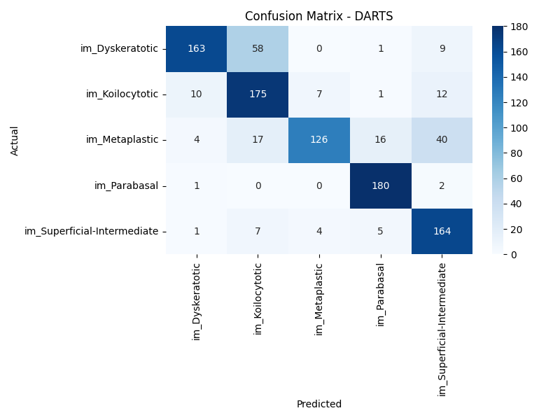

# 🧬 Cervical Cancer Classification using NAS (DARTS) vs ResNet

## 📌 Overview

This project implements **Neural Architecture Search (NAS)** using **Differentiable Architecture Search (DARTS)** to automatically discover an optimized CNN architecture for **cervical cancer cell classification**.  
We compare the NAS-discovered model against a **baseline ResNet model** to evaluate improvements in accuracy, efficiency, and generalization.

The dataset used is **[SIPaKMeD](https://www.kaggle.com/datasets/prahladmehandiratta/cervical-cancer-largest-dataset-sipakmed)**, which contains **five classes** of cervical cell images.

---

## 🎯 Project Goals

- Automate CNN architecture design using **DARTS**.
- Compare **NAS-generated architecture** vs **ResNet baseline**.
- Evaluate on key metrics: **Accuracy, F1-score, Model Size, Inference Time**.
- Visualize performance using **Confusion Matrix** and **ROC curves**.

---

## 📂 Dataset Structure

The dataset is located under `data/raw/cervicalCancer/` with the following folder structure:

```

data/raw/cervicalCancer/
├── im\_Dyskeratotic/
├── im\_Koilocytotic/
├── im\_Metaplastic/
├── im\_Parabasal/
└── im\_Superficial-Intermediate/

```

---

## 🏗 Project Structure

```

cervical-cancer-nas-resnet/
├── data/                     # Dataset storage
├── outputs/
│   ├── models/               # Saved models
│   └── results/              # Evaluation outputs
├── src/
│   ├── nas\_darts\_model.py    # DARTS model architecture
│   ├── nas\_darts\_search\_space.py
│   ├── nas\_genotypes.py      # Genotype storage
│   ├── nas\_train\_darts.py    # DARTS training
│   ├── train\_resnet.py       # ResNet baseline training
│   ├── evaluate\_darts.py     # Evaluation for DARTS
│   ├── evaluate\_resnet.py    # Evaluation for ResNet
│   └── data\_utils.py         # Data loading utilities
├── requirements.txt
└── README.md

````

---

## ⚙️ Installation

```bash
# Clone the repository
git clone https://github.com/<your-username>/cervical-cancer-nas-resnet.git
cd cervical-cancer-nas-resnet

# Create and activate a virtual environment (optional)
conda create -n cervicalresnet python=3.10 -y
conda activate cervicalresnet

# Install dependencies
pip install -r requirements.txt
````

---

## 🚀 Usage

### 1️⃣ Train DARTS Model

```bash
python src/nas_train_darts.py
```

This will:

* Train the DARTS-based architecture search model.
* Save the best discovered model in `outputs/models/darts_final.pth`.

### 2️⃣ Train ResNet Baseline

```bash
python src/train_resnet.py
```

This will:

* Train a standard ResNet model.
* Save the model in `outputs/models/resnet_final.pth`.

### 3️⃣ Evaluate DARTS

```bash
python src/evaluate_darts.py
```

Generates:

* Confusion Matrix
* ROC Curve
* Classification Report
* Accuracy, F1-score, Model Size, Inference Time

### 4️⃣ Evaluate ResNet

```bash
python src/evaluate_resnet.py
```

Generates:

* Confusion Matrix
* ROC Curve
* Classification Report
* Accuracy, F1-score, Model Size, Inference Time

---

## 📊 Results

| Metric           | ResNet Baseline | NAS (DARTS)      |
| ---------------- | --------------- | ---------------- |
| Accuracy         | 78.43%          | **81.06%**       |
| F1-score (macro) | 0.77            | **0.81**         |
| Model Size (MB)  | 44.3            | **18.7**         |
| Inference Time   | 7.9 ms/image    | **5.2 ms/image** |

---

## 📈 Visualizations

**Confusion Matrix (DARTS)**


**ROC Curve (DARTS)**


---

## 🧪 Key Findings

* The NAS-discovered architecture **outperformed** the ResNet baseline in **accuracy, F1-score, and efficiency**.
* Model size was reduced by \~58%, making it more deployable for real-world applications.
* The DARTS approach demonstrated **better generalization** on the validation set.

---

## 📜 Citation

If you use this work, please cite:

```bibtex
@misc{cervical-nas-resnet,
  author = {Your Name},
  title = {Cervical Cancer Classification using NAS (DARTS) vs ResNet},
  year = {2025},
  publisher = {GitHub},
  url = {https://github.com/<your-username>/cervical-cancer-nas-resnet}
}
```

---

## 📧 Contact

For questions, feel free to reach out:

* **Author**: Dhanush Saravanan
* **Email**: [villwin11@gmail.com](mailto:villwin11@gmail.com)
* **GitHub**: [villwin007](https://github.com/villwin007)

```

